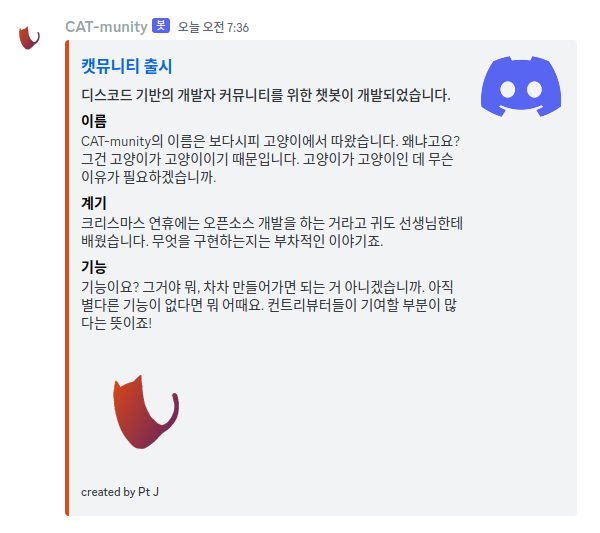

# CAT-munity

디스코드 기반의 개발자 커뮤니티에서 사용할 디스코드 봇입니다.
이런 기능도 있으면 좋겠다, 싶은 게 있으면 이슈로 남겨주시면 감사하겠습니다.
직접 구현해서 PR 주시는 것도 환영합니다.

이름이 왜 캣뮤니티냐고요?
그야 당연히 고양이는 고양이기 때문입니다.

## 기능

### 공지
 
> 관리자가 공지하고자 하는 내용을 원하는 채널에 임베드로 출력한다.

- `bind`: 공지를 올릴 채널의 ID; 미설정 시 현재 채널에 올라온다.
- `title`: 공지 제목
- `description`: 공지에 대한 간단한 부연 설명
- `footer`: 공지에 하단에 작게 들어갈 간단한 정보
- `fields`: 제목과 내용으로 구성된 공지의 세부 사항들; bool 값은 한 줄에 여러 개씩 넣을 것인가.
- `color`: 공지 임베드 좌측 색상의 색상 코드; #을 붙이지 않은 6자리 형태로 입력.
- `image`: 공지에 들어갈 이미지의 URL
- `thumbnail`: 공지에 작게 들어갈 섬네일의 URL
- `url`: 공지 제목을 클릭하면 연결될 URL; 반드시 `title` 값을 함께 사용.

```
@CAT-munity 공지 {
	"bind": 773547082115055666,
	"title": "캣뮤니티 출시",
	"description": "디스코드 기반의 개발자 커뮤니티를 위한 챗봇이 개발되었습니다.",
	"footer": "created by Pt J",
	"fields": [
		["이름", "CAT-munity의 이름은 보다시피 고양이에서 따왔습니다. 왜냐고요? 그건 고양이가 고양이이기 때문입니다. 고양이가 고양이인 데 무슨 이유가 필요하겠습니까.", false],
		["계기", "크리스마스 연휴에는 오픈소스 개발을 하는 거라고 귀도 선생님한테 배웠습니다. 무엇을 구현하는지는 부착인 이야기죠.", false],
		["기능", "기능이요? 그거야 뭐, 차차 만들어가면 되는 거 아니겠습니까. 아직 별다른 기능이 없다면 뭐 어때요. 컨트리뷰터들이 기여할 부분이 많다는 뜻이죠!", false]
	],
	"color": "dd4814",
	"image": "https://cdn.discordapp.com/app-icons/1056158461802577951/3198b218f319389587dc2d8d9c66a588.png",
	"thumbnail": "https://assets-global.website-files.com/6257adef93867e50d84d30e2/636e0a6a49cf127bf92de1e2_icon_clyde_blurple_RGB.png",
	"url": "https://github.com/neont21/cat-munity"
}
```



### 구현 예정 기능들
- 명령어를 통해 관리자가 사전 작성해놓은 커뮤니티 규칙을 출력한다.
- 반응 이모지를 통해 멤버에게 역할을 부여한다.
- 반응 이모지를 통해 투표를 진행한다.
- (그리고 더 많은 기능이 추가될 수 있습니다.)

## 라이선스

이 프로젝트는 [MIT Licence](LICENSE) 하에 배포하고 있습니다.
